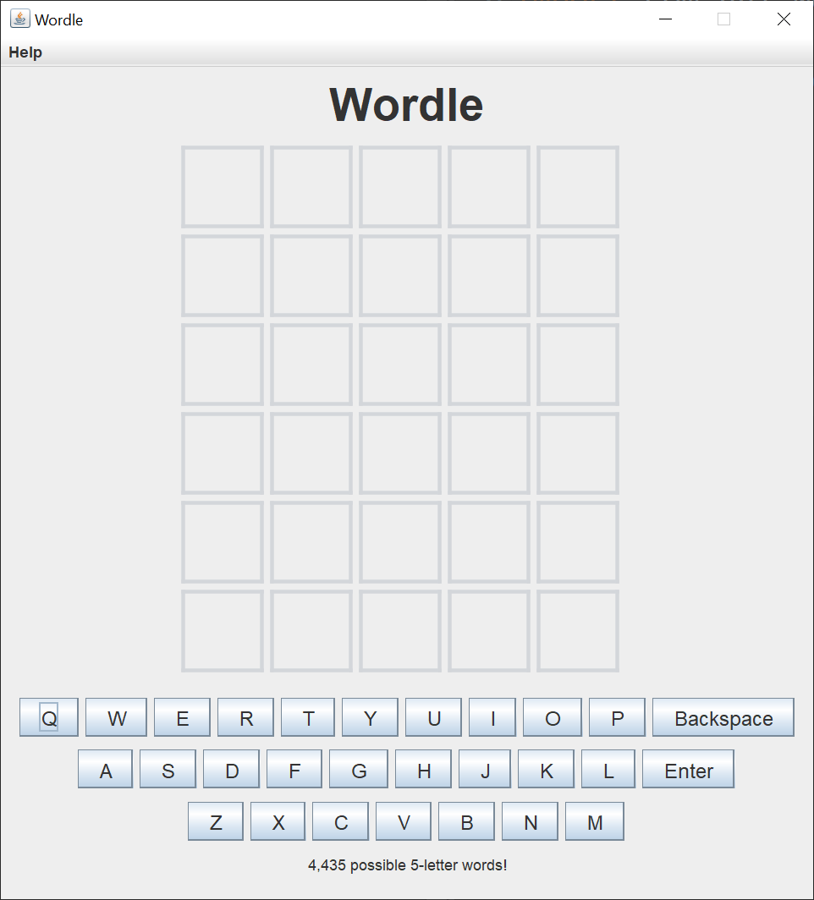
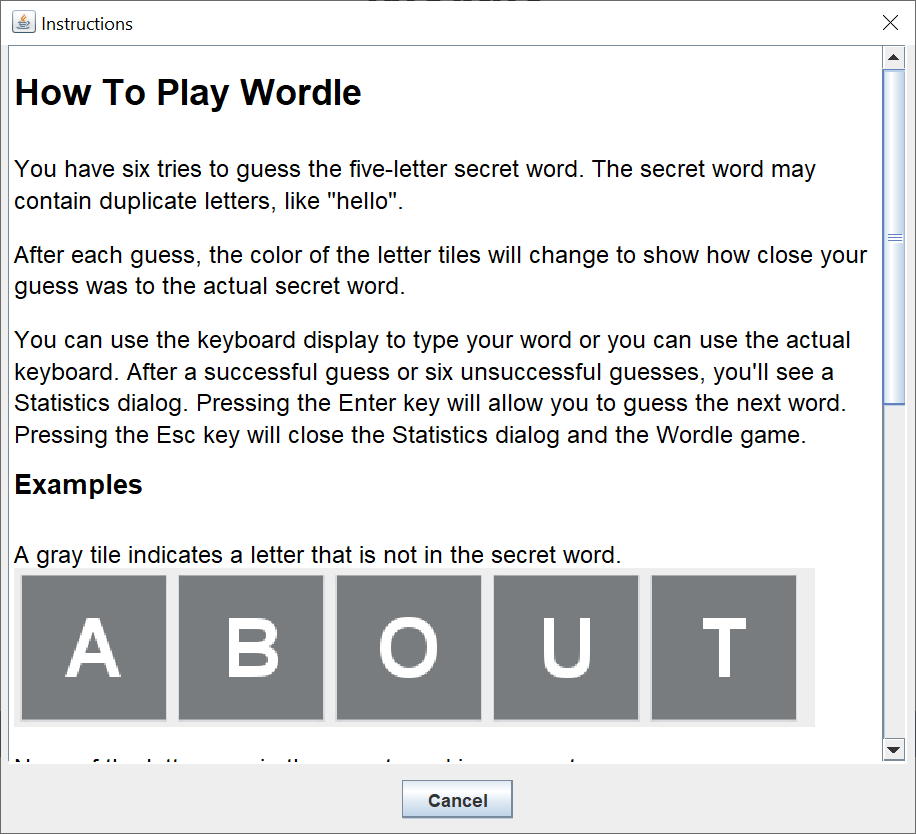
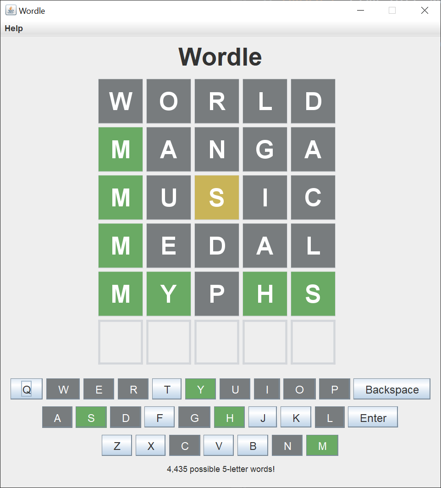

# Wordle

## Introduction

Wordle was created by software engineer and former Reddit employee, Josh Wardle, and was launched in October 2021.  I started seeing posts on Stack Overflow about three weeks ago questioning how to create a Swing GUI for this game.  I thought it would make an interesting mini-project, and as usual, I underestimated the amount of effort.  The project took me about 40 hours to complete.

Here's what I came up with.  I based my GUI design on the New York Times online version of Wordle.

The GUI is 655 x 716 and should fit comfortably on almost all modern monitors.

Clicking the Help menu and the Instructions submenu give you the instructions dialog.  Here's the first part of the instructions dialog.

Clicking on the About submenu gives you the obligatory about dialog.  Here's the about dialog.

Here's what the main game looks like after guessing five out of my six chances.  This was a tough word and I wasn't quite awake yet.  You can use the virtual keyboard on the GUI, or you can use your actual keyboard.

Pressing the Esc key on any part of the GUI will close the dialog or close the application.

Here's the statistics screen after I luckily got the word on my 6th guess.  Most of the games were "won" in a testing mode where I knew what the secret word was.

Pressing Enter on this dialog will clear the game board and allow you to guess the next word.  The application has over 4,000 5-letter words, so you can play for hours if you wish.

## Explanation

Oracle has a helpful tutorial, [Creating a GUI With Swing](https://docs.oracle.com/javase/tutorial/uiswing/index.html).  Skip the Learning Swing with the NetBeans IDE section.  Pay close attention to the [Concurrency in Swing](https://docs.oracle.com/javase/tutorial/uiswing/concurrency/index.html) and the [Laying Out Components Within a Container](https://docs.oracle.com/javase/tutorial/uiswing/layout/index.html) sections.

I created this project in small, testable steps.  I probably ran 300 to 400 tests of this project.  Using Eclipse, an integrated development environment, definitely helped me to easily run so many tests.

When I create a Swing GUI, I use the [model-view-controller](https://en.wikipedia.org/wiki/Model%E2%80%93view%E2%80%93controller) (MVC) pattern.  The name implies that you create the model first, then the view, and finally the controller.  For this project, I completed the vast majority of the model before I started on the view.

An application model consists of one or more plain Java getter/setter classes.  A view consists of a `JFrame` and one or more `JPanels`.  A controller consists of one or more action classes.

To summarize, when creating a project using Java Swing:

- The view reads information from the model.
- The view does not update the model.
- The controller updates the model and revalidates/repaints the view.

In Java Swing, there's usually not one controller to "rule them all".  Each action class updates its own portion of the model and revalidates or repaints its own portion of the view.

### Model

The model for this project consists of five classes.

The `WordleModel` class is the primary plain Java getter/setter model class.  The `WordleModel` class contains a logical Wordle grid, a list of the five-letter words, the current secret word, the current guess, and various counters.  The list of words comes from the [Dictionaries](http://www.gwicks.net/dictionaries.htm) web page.  Processing the complete USA English text list takes less time than it takes for Swing to construct the GUI.

The `Statistics` class handles the game statistics, including reading the statistics from a local file on startup and writing the statistics to the local file on shutdown.

The `WordleResponse` and `ColorResponse` classes are convenience classes that allow me to pass and return multiple values from a method.

The `AppColors` class is a central place to create the custom colors for the Wordle GUI.

### View

The view for this project consists of one main `JFrame`, a statistics `JDialog`, an instructions `JDialog`, and an about `JDialog`.  The `JFrame` is divided into three main `JPanels`; the title `JPanel`, the game grid `JPanel`, and the keyboard `JPanel`.  There are many other subordinate `JPanels`.  Breaking a complex GUI into small classes and methods makes each piece much easier to read, understand, debug, and manage.

The `JFrame` and `JDialogs` respond to the Enter key and the Esc key, as appropriate.  I use Java [Swing key bindings](https://docs.oracle.com/javase/tutorial/uiswing/misc/keybinding.html) to associate the keys with actions.

### Controller

The controllers for this project consists of a `Runnable` to read and extract the 5-letter words from a text file I downloaded, an `AbstractAction` to process the keyboard `JPanel` clicks, several private inner classes to handle the Esc and Enter keys, and other anonymous action classes for small, self-contained tasks.
